# Visualize Jobs (VizJobs): A German Job Search & Visualization CLI Tool

A command-line tool that scrapes and aggregates job listings in Germany from:

- 🔍 [JobSpy](https://github.com/speedyapply/JobSpy) (supports Indeed, LinkedIn, Google)
- 🏛️ [BudnesAPI](https://github.com/bundesAPI/jobsuche-api) An unofficial German Federal Employment Agency API

This tool combines both sources, filters by a set of arguments, and outputs clean CSV files that is used for running machine learning algorithms to predict salaries for scraped jobs with: 

- 📊 [Scikit-learn](https://scikit-learn.org/stable/) and [Joblib](https://joblib.readthedocs.io/en/latest/) (for model training and saving)

- 🎯 [TheFuzz](https://github.com/seatgeek/thefuzz) (for fuzzy string matching)

and visualize the ouptut in an interactive dashboard with:

- 📈 [Streamlit](https://streamlit.io/) (for interactive dashboards and visualization)

- 🗺️ [Streamlit-Folium](https://github.com/randyzwitch/streamlit-folium) (for embedding of interactive Folium maps into dashboard)

Each part can be used independently from the tool given that a user provides proper input file for the parts other than job scraping, as detailed below. 

---


## 📦 Features
## Job Search 🔎

- Search jobs by title and city in Germany
- Specify distance radius, job type, and age of listings
- Fetches from multiple platforms at once
- Outputs clean, structured `.csv` files
- CLI-based for automation or scripting

## Salary Prediction (ML) 📈

- Predicts the salary of the searched job based on the available parameters (location, experience level and job family)
- Provides the P10 (lower end of the salary range), the median and the P90 (higher end of the salary range) for each of the searched jobs

## Visualization 🗺️

- The dashboard was built entirely in Python using *streamlit* and offers the following features:
  - An interactive map of Germany, the federal states' geometries are loaded from [githubusercontent](https://raw.githubusercontent.com/isellsoap/deutschlandGeoJSON/main/2_bundeslaender/1_sehr_hoch.geo.json)
  - Sortable job listing tables
  - Plot visualizations
  - Export function for screenshots of plots, will be stored in the folder **viz_plots**
  - All functionalities are based on the output of job scraping and salary prediction 

---

## ⚙️ Installation

```bash
git clone https://github.com/yourusername/VizJobs-cli.git
cd app
pip install -r requirements.txt
```
**Tool Content:**
- `app/`
  - `__init__.py`
  - `VizJobs_predictor.py`
  - `VizJobs_scraper.py`
  - `VizJobs_visualizer.py`
  - `requirements.txt`
  - `README`
  - `plots_files`
    - (contains plots and files referred to in README) 
  - `resources/`
    - (contains additional files needed for running prediction)

**Make sure to have:**
- Python 3.12
- python virtual environment (e.g `python3 -m venv .py_venv`)
- preferable a bash terminal for easier environment setup
- Internet connection (and optional proxy support)


---

## 🚀 Usage

## Job Search 🔎

```bash
python3 VizJobs_scraper.py -J "Software Engineer" -C "Berlin" -R 5 -H 48 -T "fulltime"
```
The command line tool saves the csv to the current working directory.

### Required arguments:

- `-J`, `--job-title`: Job title to search for

### Optional arguments:
Arguments that have a single letter are shared between tools, and those with full name are tool specific with default values set up. See the help page with `python VizJobs.py [-h] [--help]`
- `-C`, `--city`: City to search in (default: empty)
- `-D`, `--distance`: Distance in km from city (default: 100)
- `-R`, `--results`: Max results from each source (default: 3)
- `-H`, `--hours-old`: Only jobs posted within the last X hours (default: 72)
- `-T`, `--job-type`: Type of job: `fulltime`, `parttime`, `internship`, `contract`, `nightshift_weekend`, `remote`, `minijob` (default: fulltime (api -> vz))
- `-O`, `--output`: Name of the main output file (default: combined_job_search.csv)

#### JobSpy-specific:

- `--proxies`: List of proxy servers to use
- `--proxy_ca_cert`: CA certificate for proxies
- `--google_search_term`: Custom Google query string

#### API-specific:

- `--employment_type`: `work`, `self_employment`, `dual_study`, `training`
- `--private_agencies`: Include private recruiters (default: true)

### Input:
- A combination of the inputs for both tools is used, with internal mapping between German and English Keywords.
- The tool is designed to run with as few as one single mandatory argument. All the remaining arguments have default values.
- Adding arguments makes the search more specific and by nature will usually decrease the result count. But that is not to be considered as a concern.
- For a better salary prediction, use job titles from the job titles list retrieved from the same database that was used to train the ML model (**see list** [job_list](plots_files/job_list.txt)). However, the tool can be used with literally any job title.
- Due to the heterogeneity of job advertisments, we recommend running the tool multiple times with different inputs for the same job and saving the output each time in a different file name to avoid overwriting.

## Salary Prediction (ML) 📈
```bash
python VizJobs_predictor.py --input combined_job_search.csv --output combined_job_search_predictions.csv
```
### Required arguments:
- `-I`, `--Input`: Name of the input file (default: python combined_job_search.csv)
- `-O`, `--output`: Name of the output file (default: combined_job_search_predictions.csv)

#### Input and data collection
- For the development of the salary prediction model, we had access to a **comprehensive nationwide dataset** provided by one of Germany’s leading salary data providers, made available through Elisabeth’s employer. Usage of this data was approved following internal consultation. However, we kindly ask that this data is not shared with third parties.
- As part of the most recent update in the database on March 31, 2025, a total of 1,581,960 data records from 11,323 companies were used. **The data is updated twice per calendar year. The most recent version of this data is March 31 2025.** **However, the data we use is static and will not be updated. Thus, the predicted salaries are related to 2025**.
- For our project, we extracted median salaries for each recorded job position (a total of approx. 350 positions), based on all available parameters – including location, company size, industry, job level (e.g., junior, mid, senior), company revenue, and others.
- This is annual base salaries (without extra payments like **short and long-term incentives or further bonus payments** etc.)
- Since we had to gather the data manually from **a portal** for each parameter, we needed ML to work with the median salaries over all parameters. Thus, to enrich the machine learning training base, we also randomly duplicated a subset of job positions, each time with different combinations of two key parameters: job level and federal state. These two features were chosen because they are both highly relevant to salary estimation and reliably available through job scraping.

#### Tool Independent Usage
- If the user wishes to use a different file than from the job scraper, it needs to have the following columns to ensure it working correctly:
  - **title:** Job Title (see `job_list.txt` for the titles that give the best results)
  - **state:** German abbreviated state (e.g. Bayern=BY, Bremen=HB)
  - **company_industry:** Job Family
  - **correct_job_level:** junior, mid, senior or lead

## Visualization 🗺️
```bash
streamlit run VizJobs_visualizer.py -- --input combined_job_search_predictions.csv
```

After klicking on the link on the terminal the web app will open in the browser.

### Input

#### Required arguments:
- `-I`, `--Input`: Name of the input file (default: combined_job_search_predictions.csv)

### Tool Independent Usage
For the the visualization part to be used independent of the tool, the following columns are required in csv format (missing values will appear as NA):
- median (ML-predicted salary)
- base_salary (german-wide median)
- factor_based_salary
- title
- job_url
- company
- city
- state
- date_posted
- correct_job_level

---

## 📁 Output

## Job Search 🔎

The tool creates:

- `jobspy_output_clean.csv` — cleaned results from JobSpy
- `api_output_jobs_clean.csv` — results from Federal Employment Agency API
- `combined_job_search.csv` — merged results from both sources
- Result of Job Scraping part:

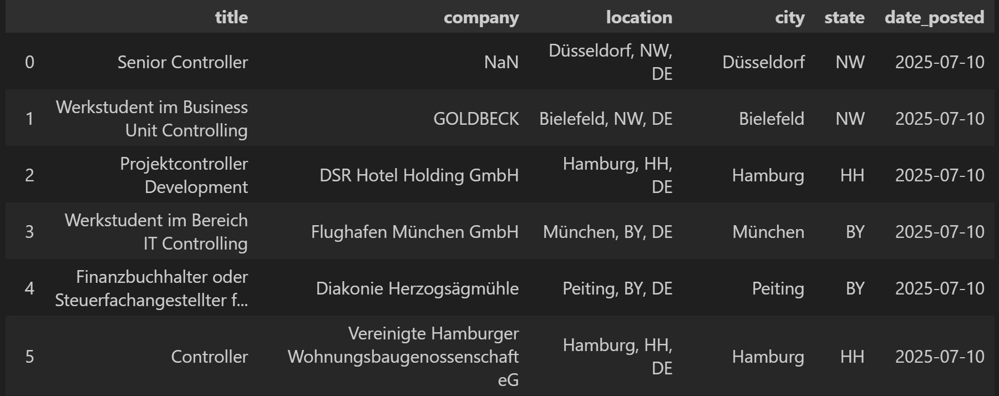

## Salary Prediction (ML) 📈
- `salary_predictor.pkl` — trained model
- `combined_job_search_predictions.csv` — new columns added on to the `combined_job_search.csv` from first part with the predicted salaries added
- Evaluation plot:

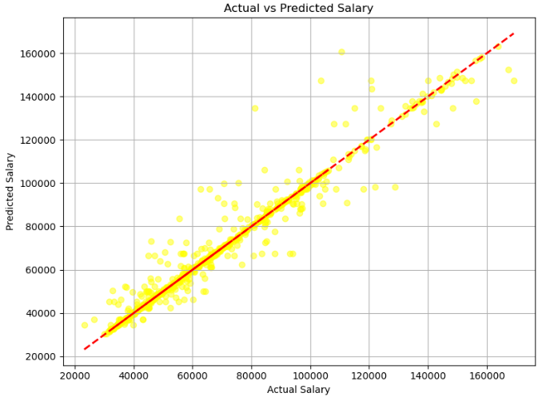


## Visualization 🗺️

### 1. Interactive map (displays all federal states in Germany)
**Two display modes:**
- Number of Jobs per state
- Predicted Average Annual Salary per State (€)
- Switching between these two modes at any time using the radio button selection above the map

**What happens on the map:**
- When hovering over a state, a tooltip appears showing:
  - The number of jobs (if in "Number of Jobs" mode)
  - The predicted average salary (if in "Salary" mode)
- The map visually indicates in which federal states job data is available:
  - Colored regions represent states with available job postings
  - Gray areas mean that no scraped job data was found for that state
- A color scales with legend for easy interpretation: In both display modes, the darker the color, the higher the value
- When selecting a specific state in the dropdown below the map (via the table filter), the corresponding state is highlighted with a red border on the map

Examples:

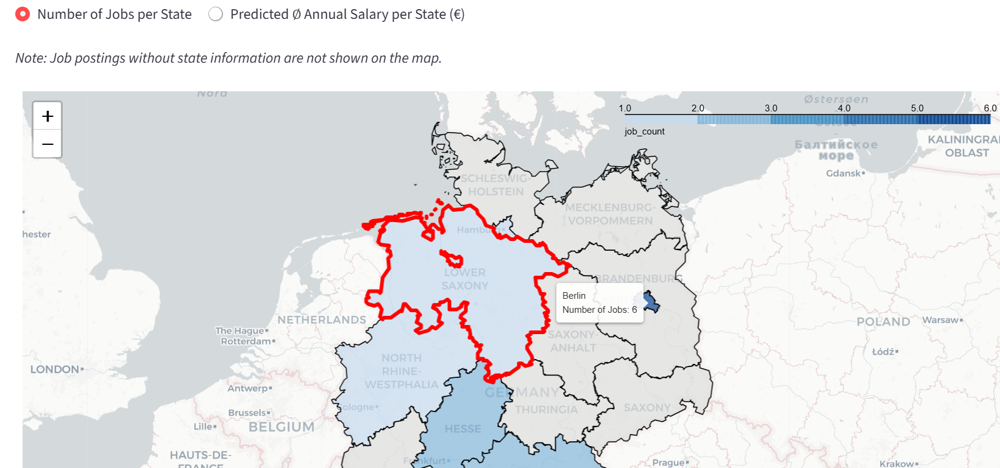
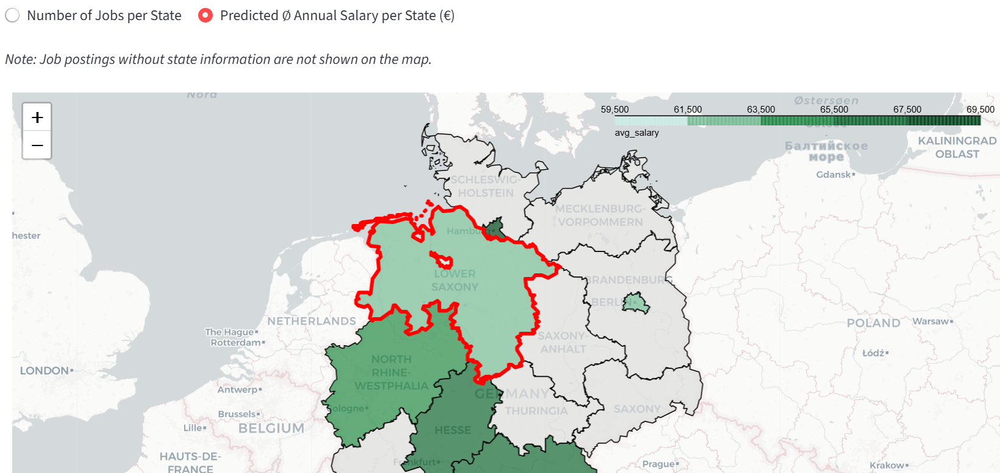

### 2. Job Data Table
- Below the map, a dynamic table that displays all available job postings regarding the output of the job scraping and salary predictions can be found
- Sorting/filtering the table using the dropdown menu above it:
  - Posting age → from newest to oldest, or oldest to newest
  - ML-predicted salary → from highest to lowest, or lowest to highest
  - Filter by state
  - Each job entry contains a clickable URL that opens the original job posting in a new browser tab
- A short explanation of the salaries shown:
  - ML-predicted salary: Predicted by a machine learning model based on real data
  - Factor-based salary: Rule-based calculation using the national median salary multiplied with fixed adjustment factors (for location, level)
- Note: If part of the table is not visible, use the scrollbar at the bottom of the table or reduce your screen zoom level

Example:

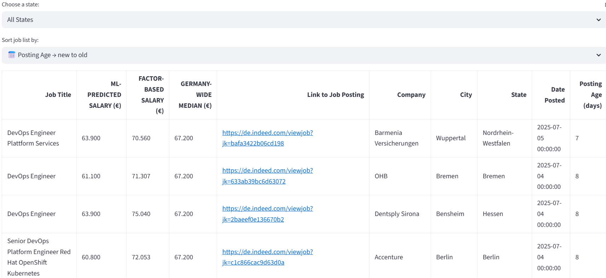

### 3. Plot Visualizations
1. A bar plot 
  - showing the distribution of job postings over time
  - Switching between daily and monthly intervals using radio buttons above the plot
2. A histogram 
  - showing the deviation between the ML-predicted salary and two benchmarks:
    - the factor-based salary
    - the Germany-wide median salary for the job title
  - Select the comparison basis using the radio buttons above the plot
3. A pie chart
  - Showing the ratio of job levels
  - Showing the average salary per job level
4. A bar plot
  - Showing the average salary per company 

Examples:

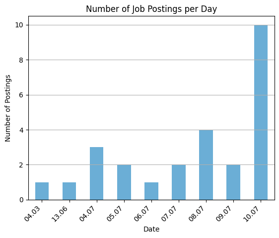 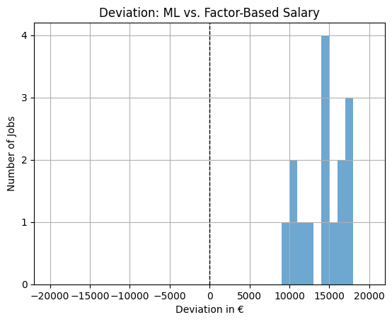 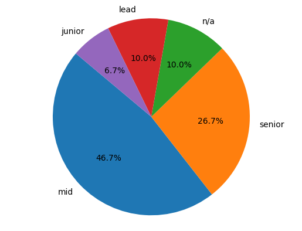 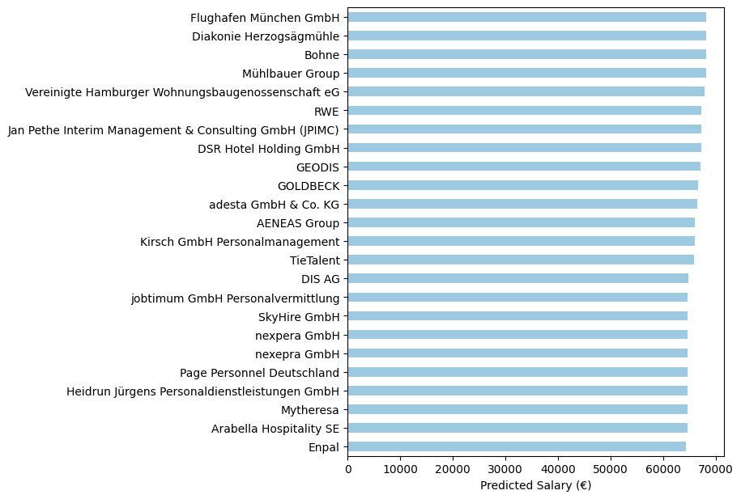

### 4. Save Button
- By clicking the button *Save All Plots*, the plots are saved as 4 PNG images in the folder `viz_plots`
- A new subfolder is automatically created within `viz_plots`, named according to the current timestamp
- Inside this timestamped folder, all plots are saved
- The map and data table is not being saved

Example:

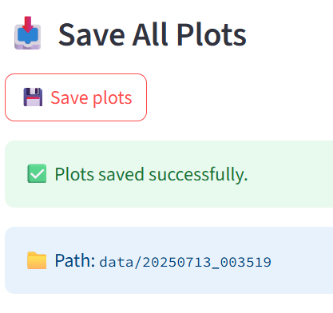

---

## 🖼 Workflow Diagram

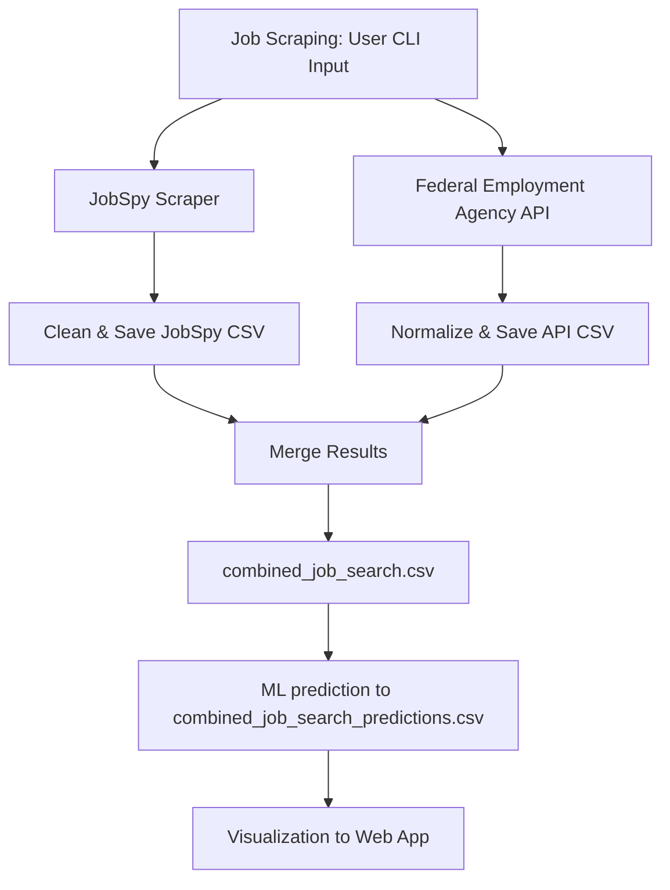
---

## 🛡️ Notes
- The Federal Employment API requires no authentication beyond an API key already included (`X-API-key: jobboerse-jobsuche`)
- Keep in mind that non-common job titles are already scarce in job boards and websites, thus are harder to scrape and predict salary for.
- For better prediction we recommend using search terms from the list `job_list.txt`
- Try different search terms as the same position can be titled differently. Alternatively try search terms in English and German for more results. In such case, we recommend copying the output 
- Available job types are slightly different across tools, the **VizJobs** maps the provided argument to the correct tool depending on the user input.

---

## 💻 Project Development
### Contribution 👥

#### Mohanad Hussein:

##### Phase 1: Tool Search & Testing
- Setting the outline and scope of the project.
- Developing the Job Scraping part.
- Searching and trying out the available alternatives to manual web scraping to find the best tool that guarantees longevity, "unlimited" usage and further development potential of this project.

##### Phase 2: Scraper Optimization
- After finding the suitable tools, they were adapted for usage in this project by developing the command-line functionality and handling tool-specific differences to make it user friendly.
- Testing the command-line scraping against multiple use cases and inputs.
- Simultaneous development in concordance with the development of the other two parts of this project to ensure matching inputs and outputs.

##### Phase 3: Merging
- Merging the three project parts and ensuring they work seamlessly.
- Restructuring the entire tool to push to gitlab

#### Nikola Kunze: 
Developing the machine learning model and applying it to the scraped jobs to predict their salaries.

##### Phase 1: Model Evaluation
The development process of the machine learning part was done by:

- Loading and exploring a structured dataset of salaries with job attributes, first with toy data and later with the collected data mentioned above.
- Preprocessing the data using a `ColumnTransformer` to one-hot encoding categorical fields.
- Training several regression models (Linear, Polynomial degree 2 and 3, Random Forest) using a pipeline architecture, splitting the data into train (0.80) and test (0.20) parts.
- Evaluating model performance with metrics such as R², MAE, and RMSE (which could only be done with the information in the data since no external validation was possible).
- Visualizing predictions against the testing part of the data to detect underfitting or overfitting:
  <h4>Development of the plot comparing the four models while in the process of adding more data and improving the model</h4>
  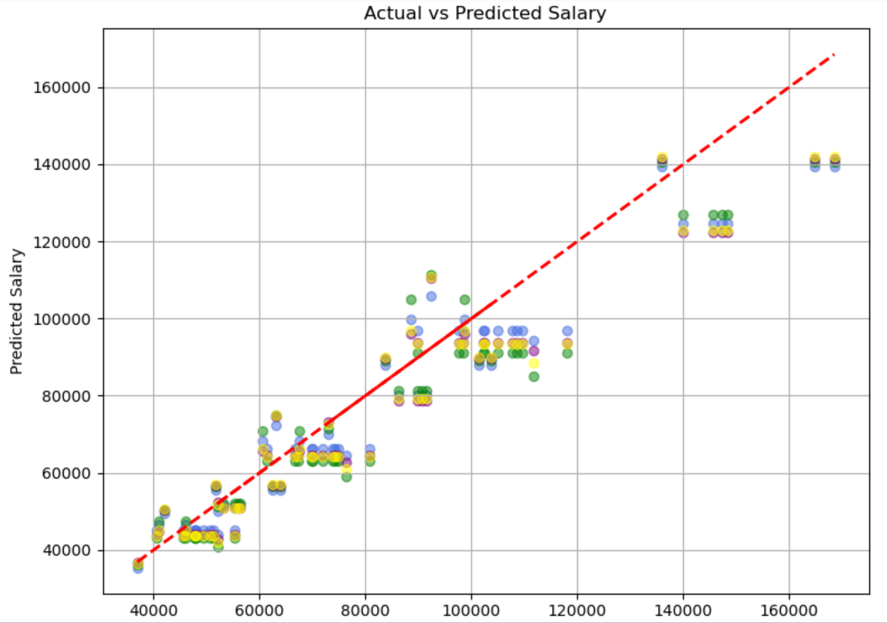 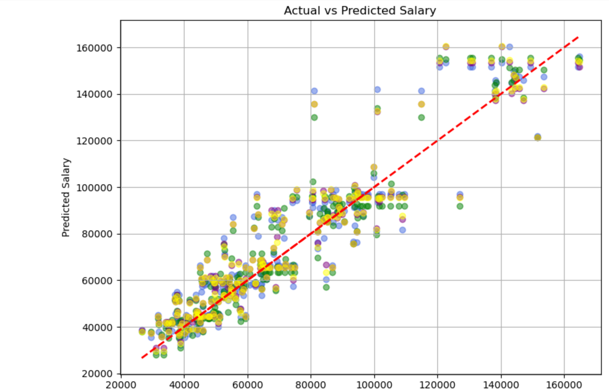 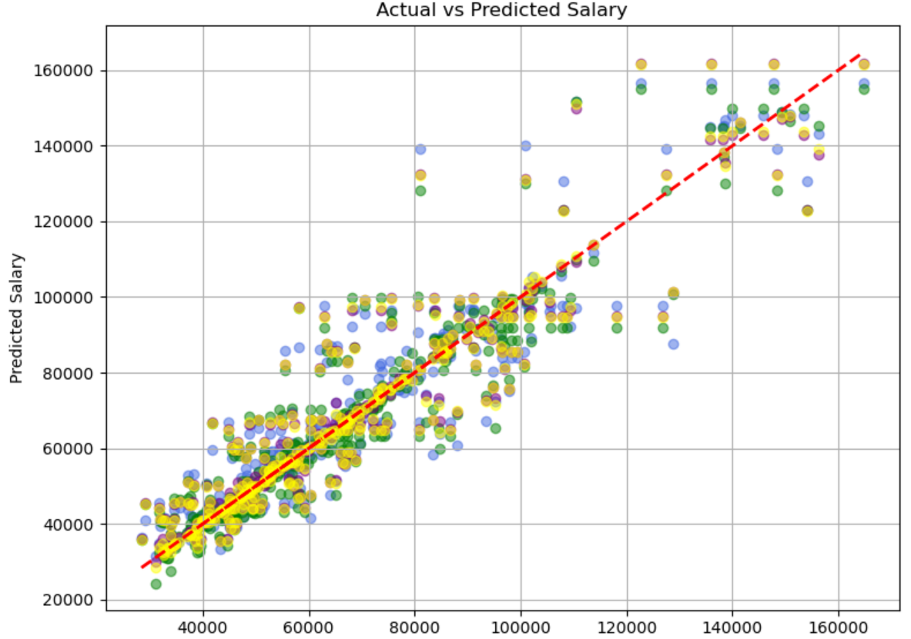 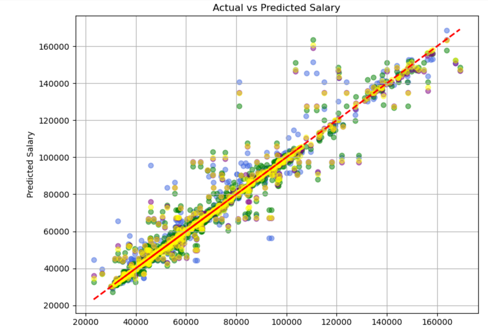


**Decision:** Based on model accuracy, the polynomial regression model of degree 2 (yellow) demonstrated a balanced performance—suitable for capturing non-linear trends without overfitting. This led to the creation of a production-ready pipeline stored as `salary_predictor.pkl`.

##### Phase 2: Model Serialization
The selected model pipeline was formalized and serialized in `model.py` for deployment purposes by:

  - Loading the salary data and defining features and target variables.
  - Preprocessing categorical variables using `OneHotEncoder` inside a pipeline.
  - Fitting the chosen model (`PolynomialFeatures` + `LinearRegression`) on the training data.
  - Exporting the trained model using `joblib.dump()` to `salary_predictor.pkl`.

  This ensured that the model architecture and preprocessing logic were preserved for consistent use in future predictions.

##### Phase 3: Prediction and Matching Logic
The `VizJobs_predictor.py` script was developed to make use of the trained model on new, incoming job data and generate salary predictions with the following functions:

- Data Cleaning & Normalization:
    - Fuzzy matching (`thefuzz`) was used to map input values for job titles, industries, and job levels to known categories expected by the model.
    - Exact matching was used for state codes to prevent false fuzzy matches on short abbreviations.
      
- Model Compatibility:
    - Extracted expected input features from the model pipeline using `feature_names_in_` to guarantee alignment.
    - Constructed the input matrix `X` with safe fallbacks for missing columns.

- Prediction Logic:
    - Applied the model to the cleaned data.
    - Stored the predicted salary values (`p10`, `median`, `p90`) and rounded them to the nearest hundred for readability.

- Benchmarking:
    - Loaded a static reference dataset (`salaries.csv`) and performed fuzzy matching to assign base median salaries for each job title.
    - Calculated deviation between model predictions and reference medians.
      
- Factor Adjustment:
    - Used pre-defined state and job level multipliers (extracted from [Gehalt.de](https://www.gehalt.de/)) to calculate a factor based salary, simulating salary adjustments by region and experience level.
      
- Export:
    - Final predictions, along with all auxiliary calculations, were saved to `combined_job_search_predictions.csv`.

#### Elisabeth Reger:

1. DATA COLLECTION AND CLEANING FOR ML

**Phase 1 - Creating Play Data**

To simulate realistic training data, a dataset of 1,000 job entries was generated using Python.
Job titles were selected from predefined families (e.g., IT, Sales, HR), each with typical roles and associated base salaries for four levels: Junior, Mid, Senior, and Leadership.
Salaries were calculated based on these base values and adjusted by two factors (base values and factors generated by AI):
- Industry factor (e.g., Consulting = +12%, Public Sector = −12%)
- Company size factor (e.g., >10,000 employees = +15%)

Each job was randomly assigned a city and state, using real coordinates for mapping.
Matching technologies (e.g., Python, SQL) and soft skills (e.g., Communication, Analytical Thinking) were sampled based on the role. Final salary values include min, median, and max, and all records were exported to a CSV file for use in model training. The approach ensures diverse, realistic combinations while remaining fully synthetic.

**Phase 2 - Real Salary Data**

After speaking to gehalt.de (stepstone.de), access to the full salary database from them is limited to B2B clients. However, a [Stepstone-Gehaltsreport-2025](plots_files/Stepstone-Gehaltsreport-2025.pdf) was provided, which helped to derive factors for 2 parameters (job level, state) as the basis for developing a factor-based salary model using parameters that are reliably scrapable, and applying them on the median base salaries (see [salary_factors](plots_files/salary_factors.csv)). This factor-based model was designed to serve as a comparison point for ML-predicted salaries.

Following discussions with my employer, access to a compensation database was granted under the condition that the data remains confidential and is not published outside of this project. Since a bulk export of all positions was technically not possible, salary bands had to be retrieved manually for each role. The data was cleaned and stored in a structured CSV file. The focus was placed solely on base salary, with elements like extra payments (short-term-incentive, long-term-incentive etc.) and other non-base components excluded. This resulted in a curated dataset of approximately 350 positions, each including a nationwide median base-salary.

**Phase 3 - Training Data Construction**

Since median salaries alone are not ideal for training a machine learning model, the generation of variations by combining randomly selected job titles with different states and job levels was done, using the same compensation portal. 
This led to a dataset of around 850 unique combinations. Each parameter was set manually, then saved to CSV, cleaned, and structured to match the ML model's input requirements (e.g., column renaming, removal of unnecessary fields, completion of missing values).


2. DASHBOARD FOR SCRAPED JOBS AND PREDICTED SALARIES

**Phase 1: Project Setup and Data Foundation**

- Defined the project objective: to visualize job postings and salary predictions across German states using Streamlit
- Specified the required input format (CSV) including ML-predicted salaries, factor-based estimates, and median benchmarks
- Standardized column names and ensured consistency across the dataset
- Set up initial Streamlit structure with layout, title, and CSV import via argparse

**Phase 2: Geospatial Integration and Preprocessing**

- Integrated a GeoJSON file with German federal state boundaries
- Mapped state abbreviations from the dataset to full state names
- Cleaned and preprocessed data: converted dates, calculated posting age, ensured numeric salary fields, handled missing values

**Phase 3: Core Visualization Features**

- Developed an interactive map with two modes
- Created a dynamic job table with filtering (by state), sorting (by salary/date), and formatted column
- Implemented four additional plots

**Phase 4: Export Functionality**
- Added a save button that exports all four plots as PNG files
- Automatically created a timestamped subfolder for saved files
- Displayed confirmation messages and filenames in the UI

**Phase 5: Final Optimization and Structure**
- Improved usability with session state handling and formatting
- Cleaned up the code: 
- Ensured full CLI compatibility via argparse and a main() entry point

### Timeline ⏳
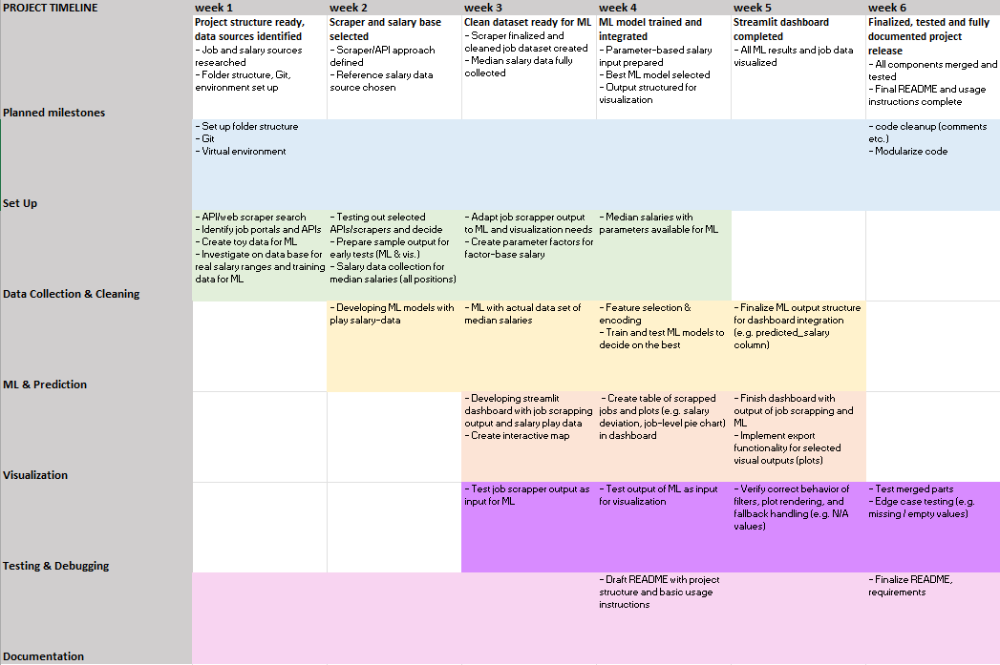

---

## 📜 License

MIT License. See `LICENSE` file.

---

## 🙋‍♂️ Authors

Developed by [Mohanad Hussein](https://gitlab.gwdg.de/m.hussein0), [Elisabeth Reger](https://gitlab.gwdg.de/elisabeth.reger) and [Nikola Kunze](https://gitlab.gwdg.de/nikola.kunze)

Pull requests and suggestions welcome!
